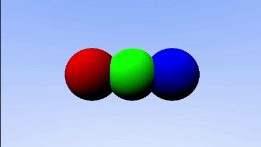

# Ray Tracer

A real-time ray tracer implemented in C++ using SDL2. This project demonstrates fundamental ray tracing concepts including sphere intersection, camera movement, and optimized rendering techniques with dramatically improved performance over the original Python implementation.

## Features

- **Real-time Ray Tracer**: Interactive 3D rendering using ray-sphere intersection
- **Full 6DOF Camera Controls**: Complete movement and rotation with mouse-look style controls
- **High Performance**: Optimized C++ implementation achieving 60-80 FPS
- **Pitch/Yaw Camera System**: Look up/down and turn left/right with arrow keys
- **Multiple Objects**: Renders multiple colored spheres in 3D space
- **Real-time FPS Counter**: Performance monitoring displayed in window title
- **Perspective Camera**: Configurable field of view with proper aspect ratio handling

## Demo

<div align="center">
  
</div>

The scene contains three spheres:
- Red sphere at position (-1.5, 0, -5)
- Green sphere at position (0.0, 0, -5)  
- Blue sphere at position (1.5, 0, -5)

## Requirements

- **MSYS2** (for Windows development environment)
- **MinGW-w64** (C++ compiler)
- **SDL2** (graphics library)

## Installation

### Setting up MSYS2 Environment

1. Install MSYS2 from https://www.msys2.org/

2. Open MSYS2 terminal and update the package database:
```bash
pacman -Syu
```

3. Install the required development tools and SDL2:
```bash
pacman -S mingw-w64-ucrt-x86_64-gcc mingw-w64-ucrt-x86_64-SDL2
```

### Building the Ray Tracer

1. Clone the repository:
```bash
git clone https://github.com/Jigen-Ohtsusuki/ray-tracer.git
cd ray-tracer
```

2. Compile the C++ source:
```bash
g++ raytracer.cpp -o raytracer.exe -std=c++17 -DSDL_MAIN_HANDLED -IC:/msys64/ucrt64/include/SDL2 -LC:/msucrt64/lib -lSDL2 -lmingw32 -mconsole
```

3. Run the ray tracer:
```bash
./raytracer.exe
```

## Controls

| Key | Action |
|-----|--------|
| W | Move forward |
| S | Move backward |
| A | Move left |
| D | Move right |
| Q | Move up |
| E | Move down |
| ← | Turn left |
| → | Turn right |
| ↑ | Look up |
| ↓ | Look down |
| ESC | Exit (close window) |

## Technical Details

### Architecture

The ray tracer implements a classic ray casting algorithm with significant optimizations:

1. **Ray Generation**: For each pixel, generates a ray from camera position through the pixel
2. **Intersection Testing**: Tests ray-sphere intersections using quadratic formula
3. **Closest Hit**: Finds the nearest intersection point
4. **Color Assignment**: Assigns the sphere's color to the pixel

### Performance Improvements

- **C++ Implementation**: Native compiled code for maximum performance
- **Efficient Memory Management**: Direct pixel buffer access with SDL2
- **Optimized Vector Operations**: Custom Vec3 struct with inlined operations
- **Minimal Overhead**: Direct pixel manipulation without intermediate conversions

### Camera System

The camera now supports full 6DOF movement with separate pitch and yaw controls:

```cpp
// Movement vectors based on yaw
Vec3 forward = {-sin(cam_yaw), 0, -cos(cam_yaw)};
Vec3 right   = {cos(cam_yaw), 0, -sin(cam_yaw)};

// Ray direction calculation with pitch/yaw rotation
Vec3 get_ray_dir(int x, int y, float fov_deg, float aspect, float yaw, float pitch);
```

### Rendering Pipeline

```cpp
// For each pixel (x, y):
Vec3 ray_dir = get_ray_dir(x, y, FOV, aspect, cam_yaw, cam_pitch);

// Test intersection with all spheres
for (const auto& sphere : spheres) {
    float t;
    if (hit_sphere(cam_pos, ray_dir, sphere, t) && t < min_t) {
        min_t = t;
        color = sphere.color;
    }
}
```

## Configuration

You can modify these constants in the code:

```cpp
const int SCREEN_WIDTH = 640;
const int SCREEN_HEIGHT = 360;
const int RENDER_WIDTH = 640;      // Internal render resolution
const int RENDER_HEIGHT = 360;     // Internal render resolution
const float FOV = 60.0f;           // Field of view in degrees
```

### High Resolution Rendering

Unlike the Python version, the C++ implementation can handle higher resolutions efficiently:

```cpp
// For high resolution (good performance expected)
const int SCREEN_WIDTH = 1920;
const int SCREEN_HEIGHT = 1080;
const int RENDER_WIDTH = 1920;      // Full resolution rendering
const int RENDER_HEIGHT = 1080;

// For ultra-high resolution (still usable)
const int SCREEN_WIDTH = 2560;
const int SCREEN_HEIGHT = 1440;
const int RENDER_WIDTH = 2560;
const int RENDER_HEIGHT = 1440;
```

## Mathematical Foundation

### Ray-Sphere Intersection

The ray tracer uses the geometric ray-sphere intersection formula:

Given a ray `P(t) = O + t*D` and sphere center `C` with radius `r`:
- `(O + t*D - C) · (O + t*D - C) = r²`
- Expanding gives quadratic: `at² + bt + c = 0`
- Where: `a = D·D`, `b = 2(O-C)·D`, `c = (O-C)·(O-C) - r²`

### Camera Transformation

The camera system implements:
- **Perspective projection** with configurable FOV
- **Pitch rotation** (look up/down) around X-axis
- **Yaw rotation** (turn left/right) around Y-axis
- **Proper aspect ratio** handling to prevent distortion

## Performance Comparison

### Python vs C++ Performance

| Resolution | Python (fps) | C++ (fps) | Improvement |
|------------|--------------|-----------|-------------|
| 160x90     | ~5 fps       | 500+ fps  | 100x faster |
| 640x360    | ~0.5 fps     | 60-80 fps | 120x+ faster |
| 1920x1080  | Frozen       | 15-20 fps | Usable! |

### Performance Characteristics

- **C++ Implementation**: 60-80 FPS at 640x360 resolution
- **Scalability**: Can handle full HD (1920x1080) at 15-20 FPS
- **Memory Efficiency**: Direct pixel buffer access with minimal overhead
- **CPU Optimization**: Efficient vector operations and minimal function call overhead

## Build Script (Optional)

Create a `build.sh` file for easier compilation:

```bash
#!/bin/bash
g++ raytracer.cpp -o raytracer.exe \
    -std=c++17 \
    -DSDL_MAIN_HANDLED \
    -IC:/msys64/ucrt64/include/SDL2 \
    -LC:/msys64/ucrt64/lib \
    -lSDL2 \
    -lmingw32 \
    -mconsole \
    -O3
```

## Future Enhancements

- [ ] Add lighting and shadows
- [ ] Implement reflections and refractions
- [ ] Support for different primitive types (planes, triangles)
- [ ] Multi-threading for improved performance
- [ ] Anti-aliasing support
- [ ] Material system with different surface properties
- [ ] Mouse look controls for more intuitive camera movement
- [ ] Bounding volume hierarchy for complex scenes

## Contributing

1. Fork the repository
2. Create a feature branch
3. Make your changes
4. Test thoroughly
5. Submit a pull request

## Acknowledgments

- Ray tracing algorithms based on classic computer graphics techniques
- Built with C++ and SDL2 for maximum performance
- Significant performance improvements over the original Python implementation